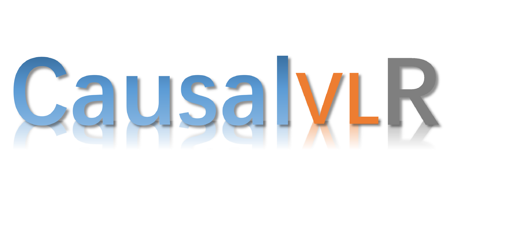

<div align="center">
  <div align="center">
      <a href="https://www.sysu-hcp.net/">
      
      </a>
    <a href="">
    
    </a>
  </div>

  
[]()
[]()
[](https://github.com/open-mmlab/mmdetection/actions)
[](https://github.com/open-mmlab/mmdetection/blob/main/LICENSE)
[](https://github.com/open-mmlab/mmdetection/issues)
[](https://github.com/open-mmlab/mmdetection/issues)

[📘Documentation]() |
[🛠️Installation]() |
[👀Model Zoo]() |
[🆕Update News]() |
[🚀Ongoing Projects]() |
[🤔Reporting Issues]()

</div>

---
<h2 id="table-of-contents">📄 Table of Contents </h2>

- [📄 Table of Contents](#table-of-contents)
- [📚 Introduction](#introduction)
- [🚀 What's New](#whats-new)
- [👨‍🏫 Get Started](#get-started)
- [👀 Model Zoo](#model-zoo)
- [🖊️ Citation](#️citation)
- [🎫 License](#license)
- [🙌 Contributing](#contributing)
- [🤝 Acknowledgement](#acknowledgement)
- [🏗️ Projects in HCPLab](#️projects-in-hcplab)


<h2 id="introduction">📚 Introduction <a href="#table-of-contents">🔝</a> </h2>
<div>
Causal-VLR is a python open-source framework based on PyTorch for causal relation discovery, causal inference that implements state-of-the-art causal learning algorithms for various visual-linguistic reasoning tasks, detail see on <a hraf="">Documentation</a>.
<p> </p>
</div>

<div align="center"><font size=5>
Framework Overview
</font>
</div>

  

<details open>
<summary>Major features</summary>

- **Modular Design**

  We decompose the causal framework of visual-linguistic tasks into different components and one can easily construct a customized causal-reasoning framework by combining different modules.

- **Support of multiple tasks**

  The toolbox directly supports multiple visual-linguistic reasoning tasks such as **VQA**, **Image/Video Caption**, **Medical Report Generation**, **Model Generalization and Robustness** and so on.

- **State of the art**

  The toolbox stems from the codebase developed by the HCPLab team, who dedicated to solving a variety of complex logic tasks through causal reasoning, and we keep pushing it forward.

</details>


❗ **Note:** The framework is actively being developed. Feedbacks (issues, suggestions, etc.) are highly encouraged.

<h2 id="whats-new">🚀 What's New <a href="#table-of-contents">🔝</a> </h2>

### 🔥 **2023.6.29**.
- **v0.0.1** was released in 6/30/2023
- Support [VLCI](projects/VLCI/readme.md) for Medical Report Generation task

<!-- > - Support [CMCIR](projects/CMCIR/readme.md) (T-PAMI 2023) for Event-Level Visual Question Answering task<-->


<div align="center">

| Dataset   | B@1 | B@2  | B@3  | B@4 | Meteor | Rough-L | CIDEr |
| --------- | --- | ---  | ---- |----- |-------| ---- | ---- |
| IU-Xray   | 32.2 | 50.2 | 82.3 | 78.4 | 38.0  | 38.9 |
| MIMIC-CXR | 33.1 | 58.9 | 84.3 | 77.5 | 42.8  | 43.7 |
</div>

<!-- div align="center">

| Dataset   | What | Why  | How  | When | Where | All  |
| --------- | ---- | ---  | ---- |----- |-------| ---- |
| MSVD-QA   | 33.1 | 58.9 | 84.3 | 77.5 | 42.8  | 43.7 |
| MSRVTT-QA | 32.2 | 50.2 | 82.3 | 78.4 | 38.0  | 38.9 |
</div -->

<h2 id="get-started">👨‍🏫 Getting Started <a href="#table-of-contents">🔝</a> </h2>
Please see Overview for the general introduction of [Causal-VLReasoning]().

For detailed user guides and advanced guides, please refer to our [documentation]().

  
 

## Installation

Please refer to Installation for [installation]() instructions in documentation .

Briefly, to use Causal-VLReasoning, we could install it using [pip](https://pypi.org/project/Causal-VLReasoning/):

```
pip install Causal-VLReasoning
```

## Running examples

For causal discovery, there are various running examples in the **‘tests’** directory.

For the implemented modules, we provide unit tests for the convenience of developing your own methods.

<h2 id="model-zoo">👀 Model Zoo <a href="#table-of-contents">🔝</a> </h2>

Please feel free to let us know if you have any recommendation regarding datasets with high-quality. We are grateful for any effort that benefits the development of causality community.

<div align="center">

|Task | Model | Benchmark |
| --- | ----- | --------- |
| VQA |  CMCIR     |           |
| MRG |  VLCI     |    IU-Xray, MIMIC-CXR       |
</div>

<h2 id="contribution"> 🙌 Contribution <a href="#table-of-contents">🔝</a> </h2>

Please feel free to open an issue if you find anything unexpected.
We are always targeting to make our community better!

# Review Paper
[Causal Reasoning Meets Visual Representation Learning: A Prospective Study](https://link.springer.com/article/10.1007/s11633-022-1362-z)     
Machine Intelligence Research (MIR) 2022      
A Review paper for causal reasoning and visual representation learning       
    

```
@article{liu2022causal,
  title={Causal Reasoning Meets Visual Representation Learning: A Prospective Study},
  author={Liu, Yang and Wei, Yu-Shen and Yan, Hong and Li, Guan-Bin and Lin, Liang},
  journal={Machine Intelligence Research},
  pages={1--27},
  year={2022},
  publisher={Springer}
}
```

<h2 id="citation"> 🖊️ Citation <a href="#table-of-contents">🔝</a> </h2>   
If you find this project useful in your research, please consider cite:    
```
@misc{2023Causal-VLReasoning,
    title={HCPLab's Visual-Linguistic Causal Learning Open-source Framework and Benchmark},
    author={Causal-VLReasoning Contributors},
    howpublished = {\url{https://github.com/YangLiu9208/Causal-VLReasoning}},
    year={2023}
}
``` 
<h2 id="license"> 🎫 License <a href="#table-of-contents">🔝</a> </h2>
This project is released under the [None]().
