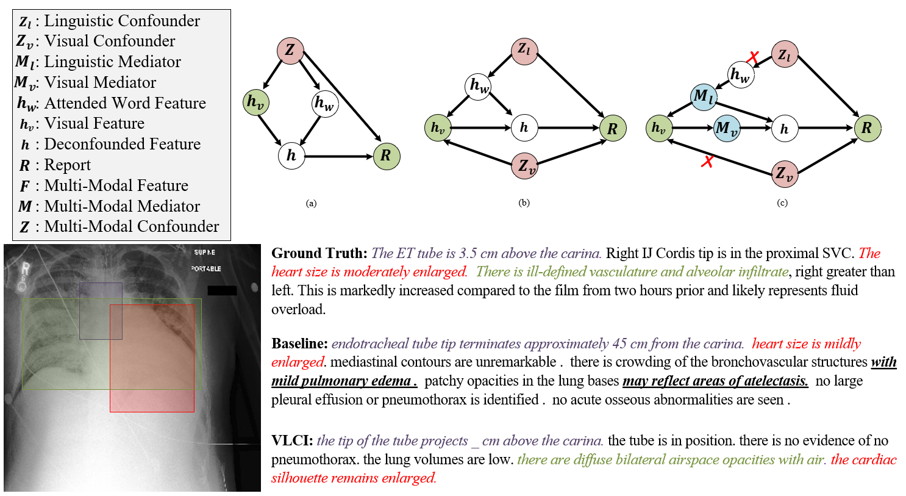
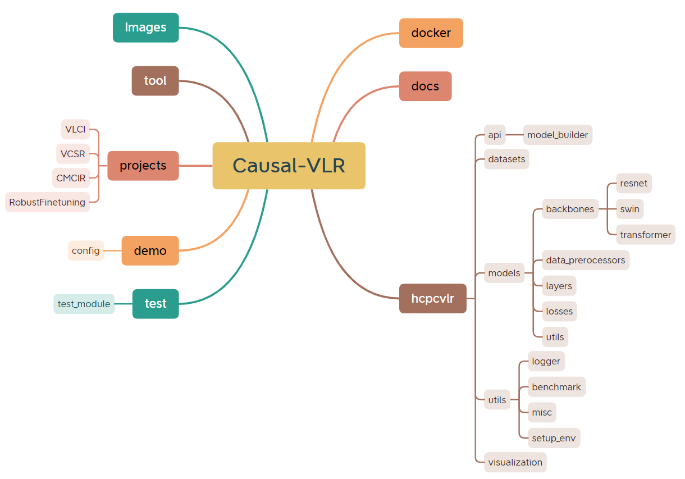

<div align="center">
  <div align="center">
      <a href="https://www.sysu-hcp.net/">
      
      </a>
    <a href="">
    
    </a>
  </div>
    </div>

CausalVLR is a python open-source framework for causal relation discovery, causal inference that implements state-of-the-art causal learning algorithms for various visual-linguistic reasoning tasks, such as VQA, Image/Video Captioning, Model Generalization and Robustness, Medical Report Generation, etc. 


  
[]()
[]()
[](https://github.com/HCPLab-SYSU/CausalVLR/actions)
[]()
[](https://github.com/HCPLab-SYSU/CausalVLR/issues)
[](https://github.com/HCPLab-SYSU/CausalVLR/issues)

[📘Documentation]() |
[🛠️Installation]() |
[👀Model Zoo]() |
[🆕Update News]() |
[🚀Ongoing Projects]() |
[🤔Reporting Issues]()

</div>

---
<h2 id="table-of-contents">📄 Table of Contents </h2>

- [📄 Table of Contents](#table-of-contents)
- [📚 Introduction](#introduction)
- [🚀 What's New](#whats-new)
- [👨‍🏫 Get Started](#get-started)
- [👀 Model Zoo](#model-zoo)
- [🎫 License](#license)
- [🖊️ Citation](#️citation)
- [🙌 Contributing](#contributing)
- [🤝 Acknowledgement](#acknowledgement)
- [🏗️ Projects in HCPLab](#️projects-in-hcplab)


<h2 id="introduction">📚 Introduction <a href="#table-of-contents">🔝</a> </h2>
<div>
Causal-VLR is a python open-source framework based on PyTorch for causal relation discovery, causal inference that implements state-of-the-art causal learning algorithms for various visual-linguistic reasoning tasks, detail see on <a hraf="">Documentation</a>.
<p> </p>
</div>


<div align="center"><font size=5>
Framework Overview
</font>
</div>

  

<details open>
<summary>Major features</summary>


- **Modular Design**
  
  We decompose the causal framework of visual-linguistic tasks into different components and one can easily construct a customized causal-reasoning framework by combining different modules.

- **Support of multiple tasks**
  
  The toolbox directly supports multiple visual-linguistic reasoning tasks such as **VQA**, **Image/Video Caption**, **Medical Report Generation**, **Model Generalization and Robustness** and so on.

- **State of the art**
  
  The toolbox stems from the codebase developed by the HCPLab team, who dedicated to solving a variety of complex logic tasks through causal reasoning, and we keep pushing it forward.

</details>


❗ **Note:** The framework is actively being developed. Feedbacks (issues, suggestions, etc.) are highly encouraged.

<h2 id="whats-new">🚀 What's New <a href="#table-of-contents">🔝</a> </h2>

### 🔥 **2023.6.29**.
- **v0.0.1** was released in 6/30/2023
- Support [**VLCI**](projects/VLCI/readme.md) for Medical Report Generation task
- Support [**CMCIR (T-PAMI 2023)**](projects/CMCIR/readme.md) for Event-Level Visual Question Answering task
- Support [**VCSR**](projects/VCSR/readme.md) for Visual Causal Scene Discovery task
- Support [**Robust Fine-tuning (CVPR 2023)**](projects/RobustFinetuning/readme.md) for Model Generalization and Robustness
---

<div>
<br>

### ✨  **VLCI**-Visual Causal Intervention for Radiology Report Generation



<div align="center">

| Dataset   | B@1 | B@2  | B@3  | B@4 | Meteor | Rough-L | CIDEr |
| --------- | --- | ---  | ---- |----- |-------| ---- | ---- |
| IU-Xray   | 50.5 | 33.4 | 24.5 | 18.9 | 20.4  | 39.7 |  45.6  |
| MIMIC-CXR | 39.6 | 24.3 | 16.3 | 11.7 | 14.9  | 28.1 | 15.7|
</div>
</div>

<!-- div align="center">

| Dataset   | What | Why  | How  | When | Where | All  |
| --------- | ---- | ---  | ---- |----- |-------| ---- |
| MSVD-QA   | 33.1 | 58.9 | 84.3 | 77.5 | 42.8  | 43.7 |
| MSRVTT-QA | 32.2 | 50.2 | 82.3 | 78.4 | 38.0  | 38.9 |
</div -->
<br>

### ✨  **CMCIR**-Cross-modal Causal Intervention for Event-level Video Question Answering


<!-- div>

| Dataset   | What | Why  | How  | When | Where | All  |
| --------- | ---- | ---  | ---- |----- |-------| ---- |
| MSVD-QA   | 33.1 | 58.9 | 84.3 | 77.5 | 42.8  | 43.7 |
| MSRVTT-QA | 32.2 | 50.2 | 82.3 | 78.4 | 38.0  | 38.9 |
</div -->

<div align="center">

|Method |Basic |Attribution |Introspection |Counterfactual |Forecasting |Reverse |All|
|--------- |--------- |--------- |--------- |--------- |--------- |--------- |--------- |
|VQAC| 34.02| 49.43| 34.44| 39.74| 38.55| 49.73| 36.00|
|MASN| 33.83| 50.86| 34.23| 41.06| 41.57| 50.80| 36.03|
|DualVGR |33.91| 50.57| 33.40| 41.39| 41.57| 50.62| 36.07|
|HCRN |34.17| 50.29| 33.40| 40.73| 44.58| 50.09| 36.26|
|**CMCIR**| **36.10** (+1.93)| **52.59** (+1.73)| **38.38** (+3.94)| **46.03** (+4.64)| **48.80** (+4.22)| **52.21** (+1.41)| **38.58** (+1.53)|
</div>

<h2 id="get-started">👨‍🏫 Getting Started <a href="#table-of-contents">🔝</a> </h2>
Please see Overview for the general introduction of <a hraf="">Causal-VLR</a>.

For detailed user guides and advanced guides, please refer to our [documentation](), and here is the code structure of toolbox.

  
 

## Installation

Please refer to Installation for [installation]("doc") instructions in documentation.

Briefly, to use Causal-VLR, we could install it using [pip](https://pypi.org/project/Causal-VLR/):

```
pip install Causal-VLR
```

## Running examples

For causal discovery, there are various running examples in the **‘tests’** directory.

For the implemented modules, we provide unit tests for the convenience of developing your own methods.

<h2 id="model-zoo">👀 Model Zoo <a href="#table-of-contents">🔝</a> </h2>

Please feel free to let us know if you have any recommendation regarding datasets with high-quality. We are grateful for any effort that benefits the development of causality community.

<div align="center">

|Task | Model | Benchmark |
| --- | ----- | --------- |
| Medical Report Generation |  VLCI     |    [IU-Xray](https://pubmed.ncbi.nlm.nih.gov/26133894/), [MIMIC-CXR](https://physionet.org/content/mimic-cxr/2.0.0/#files-panel)       |
| VQA |  CMCIR     |  [SUTD-TrafficQA](https://sutdcv.github.io/SUTD-TrafficQA/#/), [TGIF-QA](https://github.com/YunseokJANG/tgif-qa), [MSVD-QA](https://github.com/xudejing/video-question-answering), [MSRVTT-QA](https://github.com/xudejing/video-question-answering)        |
| Visual Causal Scene Discovery |  VCSR     |    [NExT-QA](https://github.com/doc-doc/NExT-QA), [Causal-VidQA](https://github.com/bcmi/Causal-VidQA), and [MSRVTT-QA](https://github.com/xudejing/video-question-answering)       |
| Model Generalization and Robustness |  Robust Fine-tuning     |    ImageNet-V2, ImageNet-R, ImageNet-Sketch, ObjectNet, ImageNet-A      |
</div>

<h2 id="license"> 🎫 License <a href="#table-of-contents">🔝</a> </h2>
This project is released under the <a hraf="https://github.com/HCPLab-SYSU/CausalVLR/LICENSE">Apache 2.0 license</a>.

<h2 id="citation">🖊️ Citation<a href="#table-of-contents">🔝</a> </h2>

If you find this project useful in your research, please consider cite:   

``` 
@misc{liu2023causalvlr,
      title={CausalVLR: A Toolbox and Benchmark for Visual-Linguistic Causal Reasoning}, 
      author={Yang Liu and Weixing Chen and Guanbin Li and Liang Lin},
      year={2023},
      eprint={2306.17462},
      archivePrefix={arXiv},
      primaryClass={cs.CV}
}
``` 

<h2 id="contribution"> 🙌 Contribution <a href="#table-of-contents">🔝</a> </h2>

Please feel free to open an issue if you find anything unexpected.
We are always targeting to make our community better!

<h2 id="acknowledgement"> 🤝 Acknowledgement <a href="#table-of-contents">🔝</a> </h2>

Causal-VLR is an open-source project and We appreciate all the contributors who implement their methods or add new features and users who give valuable feedback. We wish that the toolbox and benchmark could serve the growing research community by providing a flexible toolkit to reimplement existing methods and develop their new models.

<h3> 🪐 The review paper here can provide some help </h3>

[Causal Reasoning Meets Visual Representation Learning: A Prospective Study](https://link.springer.com/article/10.1007/s11633-022-1362-z)     
Machine Intelligence Research (MIR) 2022      
A Review paper for causal reasoning and visual representation learning       
    

```
@article{liu2022causal,
  title={Causal Reasoning Meets Visual Representation Learning: A Prospective Study},
  author={Liu, Yang and Wei, Yu-Shen and Yan, Hong and Li, Guan-Bin and Lin, Liang},
  journal={Machine Intelligence Research},
  pages={1--27},
  year={2022},
  publisher={Springer}
```


