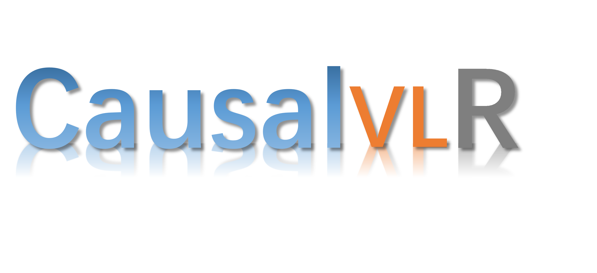

<div align="center">
  <div align="center">
      <a href="https://www.sysu-hcp.net/">
      
      </a>
    <a href="">
    
    </a>
  </div>
    </div>
    
## [HCP-Lab's](https://www.sysu-hcp.net/) Visual-Linguistic Causal Learning Toolbox and Benchmark

Causal-VLReasoning is a python open-source framework for causal relation discovery, causal inference that implements state-of-the-art causal learning algorithms for various visual-linguistic reasoning tasks, such as VQA, Image/Video Captioning, Model Generalization and Robustness, Medical Report Generation, etc. 

The framework is actively being developed. Feedbacks (issues, suggestions, etc.) are highly encouraged.

# Overview of Causal-VLReasoning 

        

Our Causal-VLReasoning implements methods for visual-linguistic causal learning:

* VQA.
* Image/Video Captioning.
* Medical Report Generation.
* Model Generalization and Robustness.
* General causal representation learning.
* General causal discovery methods.
* Multiple utilities for building your own method, such as independence tests, score functions, graph operations, and evaluations.

# Install

Causal-VLReasoning needs the following packages to be installed beforehand:

* python 3
* numpy
* networkx
* pandas
* scipy
* scikit-learn
* statsmodels
* pydot
* pytorch

(For visualization)

* matplotlib
* graphviz

To use Causal-VLReasoning, we could install it using [pip](https://pypi.org/project/Causal-VLReasoning/):

```
pip install Causal-VLReasoning
```


# Documentation

Please kindly refer to [Causal-VLReasoning Doc](https://link.springer.com/article/10.1007/s11633-022-1362-z) for detailed tutorials and usages.

# Running examples

For causal discovery, there are various running examples in the **‘tests’** directory.

For the implemented modules, we provide unit tests for the convenience of developing your own methods.

# Review Paper
[Causal Reasoning Meets Visual Representation Learning: A Prospective Study](https://link.springer.com/article/10.1007/s11633-022-1362-z)     
Machine Intelligence Research (MIR) 2022      
A Review paper for causal reasoning and visual representation learning       
    

## Citation    
```
@article{liu2022causal,
  title={Causal Reasoning Meets Visual Representation Learning: A Prospective Study},
  author={Liu, Yang and Wei, Yu-Shen and Yan, Hong and Li, Guan-Bin and Lin, Liang},
  journal={Machine Intelligence Research},
  pages={1--27},
  year={2022},
  publisher={Springer}
}
```

# Exemplar Tasks and Benchmarks

## VideoQA Task  
### [TPAMI 2023: Cross-modal Causal Intervention for Event-level Video Question Answering](https://arxiv.org/pdf/2207.12647.pdf):   
        

[Cross-Modal Causal Relational Reasoning for Event-Level Visual Question Answering](https://github.com/YangLiu9208/CMCIR)    
Benchmarks:    
[SUTD-TrafficQA](https://sutdcv.github.io/SUTD-TrafficQA/#/), [TGIF-QA](https://github.com/YunseokJANG/tgif-qa), [MSVD-QA](https://github.com/xudejing/video-question-answering) and [MSRVTT-QA](https://github.com/xudejing/video-question-answering) datasets.      

## Citation
```
@article{CMCIR,
  title={Cross-Modal Causal Relational Reasoning for Event-Level Visual Question Answering},
  author={Liu, Yang and Li, Guanbin and Lin, Liang},
  journal={IEEE Transactions on Pattern Analysis and Machine Intelligence},
  year={2023}
  doi={10.1109/TPAMI.2023.3284038}
}
@article{liu2022cross,
  title={Cross-modal causal relational reasoning for event-level visual question answering},
  author={Liu, Yang and Li, Guanbin and Lin, Liang},
  journal={arXiv preprint arXiv:2207.12647},
  year={2022}
}
```

### [Visual Causal Scene Refinement for Video Question Answering](https://arxiv.org/pdf/2305.04224.pdf):   
          

[Visual Causal Scene Refinement for Video Question Answering](https://arxiv.org/pdf/2305.04224.pdf)    
Benchmarks:    
[NExT-QA](https://github.com/doc-doc/NExT-QA), [Causal-VidQA](https://github.com/bcmi/Causal-VidQA), and [MSRVTT-QA](https://github.com/xudejing/video-question-answering) datasets.      

## Citation    
```
@article{wei2023visual,
  title={Visual Causal Scene Refinement for Video Question Answering},
  author={Wei, Yushen and Liu, Yang and Yan, Hong and Li, Guanbin and Lin, Liang},
  journal={arXiv preprint arXiv:2305.04224},
  year={2023}
}
```

## Model Generalization and Robustness
### [CVPR 2023: Masked Images Are Counterfactual Samples for Robust Fine-tuning](https://openaccess.thecvf.com/content/CVPR2023/papers/Xiao_Masked_Images_Are_Counterfactual_Samples_for_Robust_Fine-Tuning_CVPR_2023_paper.pdf):   
          

[Masked Images Are Counterfactual Samples for Robust Fine-tuning](https://github.com/Coxy7/robust-finetuning)        

## Citation    
```
@inproceedings{xiao2023masked,
  title={Masked Images Are Counterfactual Samples for Robust Fine-tuning},
  author={Xiao, Yao and Tang, Ziyi and Wei, Pengxu and Liu, Cong and Lin, Liang},
  booktitle={Proceedings of the IEEE/CVF Conference on Computer Vision and Pattern Recognition},
  pages={20301--20310},
  year={2023}
}
```

## Medical Report Generation Task  
### Visual Causal Intervention for Radiology Report Generation:      
         

[Visual-Linguistic Causal Intervention for Radiology Report Generation](https://github.com/WissingChen/VLCI)       
Benchmarks:    
IU-Xray, MIMIC-CXR datasets.    

## Citation    
```
@article{chen2023visual,
  title={Visual-linguistic causal intervention for radiology report generation},
  author={Chen, Weixing and Liu, Yang and Wang, Ce and Li, Guanbin and Zhu, Jiarui and Lin, Liang},
  journal={arXiv preprint arXiv:2303.09117},
  year={2023}
}
```

Please feel free to let us know if you have any recommendation regarding datasets with high-quality. We are grateful for any effort that benefits the development of causality community.


# Contribution

Please feel free to open an issue if you find anything unexpected.
We are always targeting to make our community better!

### Citation
If you find this project useful in your research, please consider cite:    
```
@misc{2023Causal-VLReasoning,
    title={HCPLab's Visual-Linguistic Causal Learning Open-source Framework and Benchmark},
    author={Causal-VLReasoning Contributors},
    howpublished = {\url{https://github.com/YangLiu9208/Causal-VLReasoning}},
    year={2023}
}
``` 
